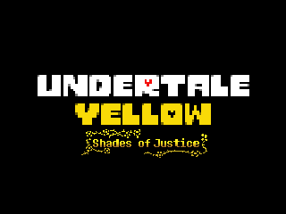

# Proof — headless boot verification

These screenshots are checked-in artifacts captured by
`port/wasm/tools/screenshot.js` from the local self-hosted web build. They are
linked below so the proof is visible directly from the repository README.

| Loader | After load | After keys |
|---|---|---|
| [](00_loader_640.png) | [](01_afterload_640.png) | [](02_afterkeys_640.png) |

| GameShell viewport | GameShell after key |
|---|---|
| [](03_320x240_fullgame.png) | [](04_320x240_afterkey.png) |

## Capture details

- `00_loader_640.png`: 640×480, five seconds after navigation.
- `01_afterload_640.png`: 640×480, after the 100-second WAD/wasm wait.
- `02_afterkeys_640.png`: 640×480, after Enter, Space, and Z keypresses.
- `03_320x240_fullgame.png`: 320×240, matching the GameShell native viewport.
- `04_320x240_afterkey.png`: 320×240, after another Enter keypress.

Regenerate with:

```sh
node port/wasm/tools/screenshot.js port/wasm/proof
```

The capture harness reports browser console errors, page errors, failed
requests, and HTTP errors. The checked-in images demonstrate the loader,
post-load interaction, and native-size scaling. They do not claim that an
unofficial web build is an official UTY release or that battle-specific zoom
has been implemented.
