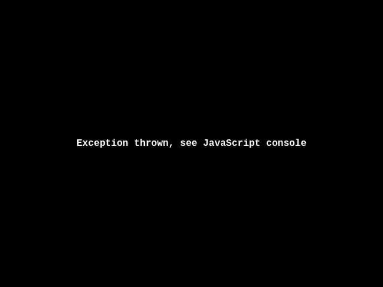
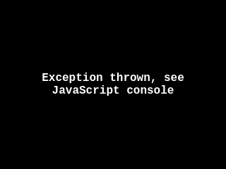

# Proof — current capture status

The previous PNGs are **failure captures**, not successful gameplay proof. They
show the loader's error screen and must not be read as evidence that UTY boots.

## Observed failure

The headless capture reached the bundled WebGL runner, then failed with:

```text
TypeError: Cannot read properties of undefined (reading 'depthRange')
at runner.js:7725
```

It also requested this invalid path:

```text
/undefined/pages/home.html
```

The capture harness now logs full page-error stacks, HTTP failures, and failed
requests. Run it after installing a real Chromium binary (not the Ubuntu snap
wrapper):

```sh
bun add --dev puppeteer
CHROMIUM_PATH=/path/to/chromium node port/wasm/tools/screenshot.js port/wasm/proof
```

## Existing artifacts

The PNGs below preserve the failed run for regression comparison:

| Loader failure | Post-load failure | 320×240 failure |
|---|---|---|
| [](00_loader_640.png) | [](01_afterload_640.png) | [](03_320x240_fullgame.png) |

Do not use these images as a gameplay screenshot. A new capture should replace
them only after the harness exits cleanly and reports no page errors, HTTP 4xx/
5xx responses, or failed requests.
